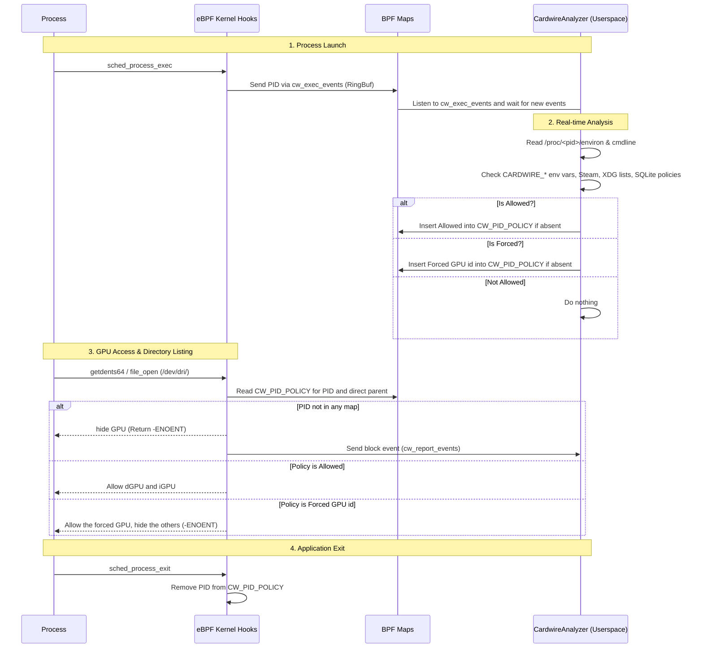

# Smart

## Goal and integration

Cardwire owns its per-application policy. It does not depend on desktop environment heuristics like `PrefersNonDefaultGPU` or on `DRI_PRIME`, `__NV_PRIME_RENDER_OFFLOAD` or SteamAppId being present in the app environment. Those auto-approval inputs were dropped in 0.12.0 and replaced by the internal application list, which makes cardwire self-sufficient while staying compatible with desktop environments through the [Switcheroo shim](dbus/switcheroo.md).

Third parties that want to integrate with cardwire get three surfaces:

- **Env**: the `CARDWIRE_*` environment variables route a process to a GPU at launch. The per-GPU environment can be fetched from the `Env` property of the [Gpu interface](dbus/gpu.md).
- **PID via API**: `RequestProcessAccess` atomically replaces the PID's `CW_PID_POLICY` entry. In this fork this administrative API requires an authenticated UID 0 system-bus caller. Apply it to an existing process (caution: applications often scan for GPUs at launch).
- **Management**: the [SmartPolicy D-Bus interface](dbus/smart-policy.md) lists known applications (`GetAppPolicies`), changes their persistent policy (`SetAppPolicy`) and announces discoveries (`NewAppAdded`).

One caveat applies to both routes: the eBPF program clears the PID's policy at every exec, so a process that execs again after being classified starts from a clean slate and is re-evaluated.

## Introduction

Having an integrated and hybrid mode is good, but what if we could have the best of both worlds?

This is what cardwire's smart mode was made for. Cardwire uses a mix of kernel-space + userspace to directly allow processes on the fly

### Kernel-Space

Using the eBPF program and the `tracepoint/sched/sched_process_exec` hooks, the kernel program notifies `cardwired` when a new process is executed, sending its pid using the `CW_EXEC_EVENTS` RING_BUF (in Smart and Manual modes). The analyzer may insert one `CW_PID_POLICY` entry. Its shared `u64` encoding represents Allowed (`1 << 32`), AllowedExact (`2 << 32`), or Forced (the `u32` GPU ID). There cannot be two conflicting entries for a PID. Only the root-authenticated administrative API creates AllowedExact; existing environment/application rules still use their original policies.

Exec and main-thread exit hooks remove the PID's policy entry directly.

The maintained fork obtains the two task fields used by parent-policy lookup
from the running kernel's BTF. Initialization validates their types and layout
before attaching hooks; it does not fall back to generated `task_struct` offsets
if the layout is unsupported. File/inode hooks also resolve the fields they
read from `file`, `path`, `dentry` and `inode`, rather than dereferencing
build-time structures. Embedded anonymous/named unions are checked explicitly;
unsupported layouts fail initialization before hooks attach. VM tests exercise
both device opens and permission-only checks, so a working open hook does not
hide an incorrect inode-permission lookup.

If you want to dive deeper into the kernel code, take a look at [BPF](bpf.md)

### Userspace

The userspace of Smart mode acts as the brain. It is responsible for making the actual decisions about whether a process is allowed to use a GPU. It is divided into three main components:

- **`CardwireAnalyzer`**: A dedicated background task that listens to the `CW_EXEC_EVENTS` ring buffer (and the `CW_REPORT_EVENTS` ring for blocked-access logging). It analyzes each new PID and inserts a `CW_PID_POLICY` entry using `BPF_NOEXIST`, preserving any administrative policy installed during analysis.
- **`dynamic_analysis.rs`**: A set of helper functions used to analyze a process in real-time. By reading `/proc/<pid>/environ` and `/proc/<pid>/cmdline`, it checks for explicitly requested GPUs (like `CARDWIRE_ALLOW=1`, `CARDWIRE_FORCE_DGPU=1`, `CARDWIRE_FORCE_GPU=<gpu_id>`) or implicit signs like Steam games (`SteamAppId`, the `0` and `769` ids are excluded).
- **`static_analysis.rs`**: A set of helper functions that analyze system data when the daemon starts. It scans the XDG data directories and watches them with inotify so new apps are picked up at install time. Every discovered app is blocked by default until the user allows it. The `xdg-desktop-portal` process is always blocked.

#### Notes

Technically, it's a pure race condition between the cardwire analyzer and the process, cardwire scans and allow a process in ~60-100 microseconds, from my testing, no process initialized its render before cardwire allowed it

## Complete Execution Flow

Here is a comprehensive breakdown of how the Kernel and Userspace interact in real-time when an application launches: (Please zoom on it)



## Application policies

Smart mode is only available on laptops (`SystemType::Laptop`). Per-application policies are stored in the `app_policies` table of the daemon's SQLite database, with two values: `Blocked` and `Allowed`. Known apps are blocked by default until the user allows them, and newly discovered apps are announced through the `NewAppAdded` D-Bus signal.

The policy for a process can be overridden at runtime through the `org.opengamingcollective.cardwire.SmartPolicy` D-Bus interface (`RequestProcessAccess`, `GetProcessStatus`, `GetAppPolicies`, `SetAppPolicy`). Note that `GetProcessStatus` returns an empty string (not `"Default"`) for unclassified processes.

`RequestProcessAccess` accepts `Allow_dGPU`, `Allow_dGPU_Exact`, `Force_dGPU`, and `Force_GPU` for an existing process after authenticating the sender as root. Each request makes one complete map update; an error preserves the previous entry. Concurrent requests cannot leave both Allow and Force active for one PID. `GetProcessStatus` reads that same entry. `Default` remains an authenticated no-op, not a way to revoke a previous request. The method's wire signature is unchanged.

`Allow_dGPU_Exact` requires `value=1` and returns status `("AllowedExact", [0])`.
In Smart it allows only the named process (TGID, including its threads), not a
separate child through the parent-PID lookup. This is intended for narrowly
audited display/driver exceptions. A child with no other exception remains on
the default iGPU policy. Manual mode ignores both types of Allow. Legacy
`Allow_dGPU` behavior, including its direct-parent precedence, is unchanged.

This does **not** revoke already opened or inherited descriptors, prevent FD
passing, validate process identity beyond the numeric PID, or stop a child
obtaining its own permission via environment/app policy or a built-in exemption.
Exec clears the entry; restart creates a new PID. A profile controller still
needs a verified lifecycle policy, without granting a whole desktop launcher.
Deploy the daemon and its embedded eBPF together; older builds do not support
this policy. It is not enabled merely by upgrading and is not a security sandbox.

Status reports the PID's own policy, not inherited effects. Smart mode retains direct-parent Allow precedence; Manual mode ignores Allow entries. Numeric PID lifetime races, environment hints, built-in exemptions and authorization of other global APIs remain outside this change. See [the fork notes](../../FORK.md) for the security and deployment boundaries.

Force_GPU can be used on all systems with the Manual mode.

## Persistent service profiles: implementation boundary

Persistent Gaming/Work service roles are **not implemented** by `AllowedExact`.
The VM-only `nix/lifecycle-baseline-probe.py` reproduces four current gaps:
an authorized environment hint can miss the executable's first device open;
same-PID exec clears an Exact grant; daemon restart loses grants; and stopping
the unpinned daemon removes its enforcement. This is a known-gap reproducer,
not an acceptance test that declares these behaviors correct.

The selected direction is synchronous admission for narrow, registered service
roles, with process lifetime identity and enforcement retained across daemon
restarts. Cgroup/executable matching alone is insufficient for Exact semantics:
a forked child initially shares its parent's executable. Do not substitute
a parent/session-manager grant or delayed userspace reconciliation.

`nix/task-storage-probe.py` checks one prerequisite in the disposable x86_64
two-GPU VM: pidfd-addressed task-storage entries, no fork inheritance, dead-pidfd
rejection, explicit deletion, and a pinned map surviving closure of all map
FDs. It also demonstrates that **exec does retain task storage**: the future
exec hook must invalidate/revalidate the role. It attaches no BPF programs and
does not implement admission, executable/cgroup checks, thread-group semantics,
link persistence, device-node tracking, or an application sandbox. Aya 0.14
currently represents this map type as `Unsupported`, so this feasibility probe
uses raw UAPI; it is not a production wrapper or a dependency upgrade.

Before desktop activation, verify one synthetic service role from its very
first device open through exec, fork, cgroup recreation, and daemon failure.
Strict service exclusion must be independent of the legacy Hybrid bypass and
must not be overridden by environment/app/comm exceptions. Live graphics and
inference restarts still need separately authorized tests. Existing/passed GPU
descriptors and trusted-root administration remain outside the isolation claim.

### VM-only synchronous role candidate

The next implementation is deliberately separate from the installed daemon:

- `nix/service-role-guard.bpf.c`: CO-RE exec admission and protected device-open
  checks, with task storage on the thread-group leader. Admission matches the
  current UID/EUID, executable inode/device, and exact cgroup object/ID.
- `crates/cardwire-ebpf-userspace/examples/service-role-vm.rs`: explicit VM-only
  Aya loader; pins both hooks and all maps, then exits. Aya's unsupported-map
  opt-in is local to this example, not a daemon-wide change. `--inspect-pinned`
  checks the configuration map only; it does **not** implement safe adoption.
- `nix/service-role-worker.c`: static executable whose constructor opens the
  protected GPU before `main()`, plus thread/fork/exec probes.
- `nix/service-role-probe.py`: real opens and negative controls, including
  pidfd admission of an existing process, changed executable/UID/cgroup,
  a nested cgroup, device-node alias, policy generation, and cgroup recreation.
  It checks access while guest Cardwire is stopped and after it starts again.

The standalone guard remains active while its loader is absent; the test
controller still holds the executable and cgroup FDs. This is **not** yet a
daemon crash/restart ownership protocol. In the tested x86_64 guest, attaching
the existing Cardwire hooks after the candidate does not override its denial.
Do not report a confirmed LSM chaining bypass based on source inspection alone.

Limits: one root-owned role, one virtio render node, no real NVIDIA/CUDA workload,
no fdstore or reboot persistence, no multi-role transaction or atomic policy
generation publication, no hostile-user sandbox, and no complete device
inventory. Existing/passed descriptors cannot be revoked. Root administration
is trusted. No shipped Cardwire mode or desktop profile loads this object.

Build the fixtures **inside an isolated build environment**, using the fork's
normal Rust/BPF prerequisites plus clang and libbpf headers. The tested native
build used Rust 1.95.0, the pinned BPF nightly, and clang 14:

```sh
cargo +1.95.0 test --locked --release -p cardwire-ebpf-userspace --example service-role-vm
cargo +1.95.0 build --locked --release -p cardwire-ebpf-userspace --example service-role-vm
clang -target bpf -O2 -g -Wall -Wextra -Werror -I/usr/include/x86_64-linux-gnu \
  -c nix/service-role-guard.bpf.c -o cardwire-role-guard.bpf.o
cc -static -O2 -Wall -Wextra -Werror -pthread \
  nix/service-role-worker.c -o cardwire-role-worker
```

For `nix/service-role-vm-test.py`, supply an existing disposable two-virtio-GPU
NixOS test-driver configuration without host GPU/PCI passthrough. Set
`CARDWIRE_ROLE_ARTIFACT_DIR` to an absolute directory containing the loader
(named `cardwire-role-loader`), both C artifacts, and both Python probes
(`service-role-probe.py`, `task-storage-probe.py`). Set `CARDWIRE_ROLE_PYTHON`,
`CARDWIRE_ROLE_ELF_LOADER`, and `CARDWIRE_ROLE_LIBRARY_PATH` to the matching
Python, ELF loader and runtime library paths **inside the guest**. These are
explicit to avoid modifying the native loader's ELF metadata. Use the driver's
`--test-script` option; this candidate is not in the default Nix CI matrix yet.
Never invoke either loader or probe on the desktop.

### VM-only persistent owner handover

`cardwire-ebpf-userspace::fdstore` provides explicit named-FD activation,
SCM_RIGHTS notification and barrier transport. It is compiled but **not called
by the shipped daemon**. This uses systemd's
[file descriptor store](https://raw.githubusercontent.com/systemd/systemd/main/man/systemd.service.xml)
with `FileDescriptorStorePreserve=yes`; a
[notification barrier](https://raw.githubusercontent.com/systemd/systemd/main/man/sd_notify.xml)
alone does not confirm successful storage. The VM owner also checks the unit's
configured capacity, its own MainPID, and the stored descriptor count.

The separate `service-role-owner-vm` example exercises the ownership protocol
intended for eventual integration into **existing cardwired**, not a second
production GPU manager. Before attaching enforcement it stores references to
the exact executable and cgroup. Then it records a sealed memfd manifest of
the role, map ABI/IDs, and link/program identities. After a restart it consumes
the named descriptors with CLOEXEC, checks that complete manifest and confirms
that the attached programs refer to those same maps. It never silently rebuilds
missing, partial or inconsistent ownership state.

`nix/service-role-owner-probe.py` holds no extra executable/cgroup FDs. In the
disposable VM it verifies owner SIGKILL, access while the owner is absent,
same-guard adoption, explicit stop/start, replacement of the executable at the
same path, and recreation of the cgroup at the same path. Substituting an empty
same-ABI map is rejected while the original attached enforcement remains intact.
The final scenario retains the old cgroup identity and denies its replacement;
service restart re-enrollment is a separate implementation still to be done.

To run this variant, build `--example service-role-owner-vm`, put it in the
artifact directory as `cardwire-role-owner`, add `service-role-owner-probe.py`,
and set `CARDWIRE_ROLE_PROBE=service-role-owner-probe.py` for the same VM driver.
The probe creates and tears down only its fixed disposable guest unit. It does
not restart guest Cardwire. The test has no automatic restart loop.

This proves single-role reference retention and checked adoption in the test
guest, not production service registration, reboot persistence, atomic
multi-role updates, NVIDIA device enumeration, or desktop profile activation.
The existing one-role limits above still apply. Do not clean a production
owner's FD store independently of its enforcement deactivation transaction.

### Opt-in immutable multi-role snapshots (VM candidate)

The `experimental-service-roles` feature now exposes `service_guard` in the
userspace crate. **No shipped daemon path enables it.** The shared
`cardwire-policy::service_roles` ABI and
`crates/cardwire-ebpf/src/service_guard.bpf.c` implement up to 16 exact service
roles and 16 explicitly supplied character-device identities. This object is
compiled separately, not silently added to the daemon's build or install path.

Each publication prepares and freezes a fresh complete policy array, then
replaces one entry in an array-of-maps. One open/exec decision reads one inner
map, so it cannot combine separately published headers and role entries.
Validation and allocation precede publication. Duplicate identities, unknown
device bits, non-increasing generations and reused admission incarnations for
removed/replaced roles are rejected without replacing the current policy.
This follows the kernel's [map-in-map model](https://docs.kernel.org/bpf/map_of_maps.html).

Policy generation and service admission incarnation are deliberately separate:
permission-only profile changes retain the same service's task ticket, while
each open checks the newly published permissions. An unchanged inference role
therefore does not need exec or a service restart during such a change.
Removing/recreating/reordering a role invalidates its old ticket; explicit
re-registration and admission are required. Already-open/passed FDs are still
outside this open-time policy, not revoked by it.

The candidate holds executable/cgroup FDs for every published identity and
conservatively retains retired generations until teardown. It rejects a 257th
publication rather than evicting references unsafely. This bounded prototype
needs a persistent ownership/retirement protocol before production use.
Unlike the preceding single-role owner fixture, **this multi-role owner is not
pinned and does not use FD store yet**: its exit removes its enforcement. Do not
combine the separate VM results into a claim of crash-safe multi-role profiles.

`service-snapshots-vm` is a guarded disposable-VM frontend to that same Rust
backend. `nix/service-snapshots-probe.py` tests real constructor/open calls:
initial deny-all, two independent roles/two protected nodes, unchanged inference
PID/admission across permission changes and 24 more swaps, outsider/fork
denial, malformed updates, kernel-enforced map freezing, remove/reintroduce,
cgroup recreation, device aliases and bounded teardown. These are synthetic
virtio workers, not real CUDA inference or desktop rendering. It does not
restart guest Cardwire. Repeated sequential swaps are regression coverage,
not an exhaustive concurrency proof.

Build with the same isolated toolchain described above:

```sh
cargo +1.95.0 test --locked --release -p cardwire-policy
cargo +1.95.0 build --locked --release -p cardwire-ebpf-userspace \
  --features experimental-service-roles --example service-snapshots-vm
clang -target bpf -O2 -g -Wall -Wextra -Werror -I/usr/include/x86_64-linux-gnu \
  -c crates/cardwire-ebpf/src/service_guard.bpf.c -o cardwire-service-guard.bpf.o
```

Add the example as `cardwire-service-snapshots`, its object and
`service-snapshots-probe.py` to the existing VM artifact directory; select
`CARDWIRE_ROLE_PROBE=service-snapshots-probe.py` for `service-role-vm-test.py`.
The observed two-virtio-GPU Linux 6.18.46 run passed. This does not establish
compatibility with every target kernel or implement authenticated unit
registration, NVIDIA inventory/hotplug, existing-process adoption, restart
re-enrollment, Gaming/Work profile selection or UI/rollback. Persistent ownership
must be combined with this backend inside existing Cardwire before activation.

### Persistent fixed-registration permission owner (opt-in candidate)

`service_guard::persistent` now combines immutable permission publication with
pinned enforcement and systemd-held identity references. It is still behind
`experimental-service-roles`, with **no installed daemon caller**. The preceding
un-pinned example remains a distinct fixture.

The fixed registration/device catalog is recorded in a sealed memfd manifest.
Executable/cgroup references are retained by PID1 before pinning the hooks;
startup validates the complete descriptor set, object identities, map ABI/IDs,
link/program relationships and immutable active policy. `prepare_permissions`
creates a frozen replacement; `commit` swaps one outer-map pointer. That pointer
is also the recovery record, so no post-commit userspace journal update is needed.
Transactions are bound to their owner map and base generation. Permission-only
changes do not accumulate old registration references. Replacement registrations
and inventory changes are deliberately not implicit operations.

Build `--features experimental-service-roles --example persistent-snapshots-vm`,
place it in the artifact directory as `cardwire-persistent-snapshots`, add
`persistent-snapshots-probe.py`, and select that probe in the existing VM driver.
The Linux6.18.46 two-virtio-GPU test passed actual owner SIGKILL before/after
commit, access while the owner is absent, checked adoption, 300 permission
changes with stable FD counts and uninterrupted synthetic inference admission,
stop/start, rejection of a foreign same-ABI map, and denial after cgroup
recreation. It does not restart the guest's installed Cardwire.

This is not production profile activation or a CUDA test. Integration into
existing cardwired, initial-bootstrap crash recovery, authenticated registration,
service restart re-enrollment, actual NVIDIA inventory/lifecycle and explicit
deactivation/rollback remain necessary. The fixture control socket is VM-only;
it is not a new production management API. As before, existing/passed device
descriptors are not revoked and trusted root is outside the isolation boundary.

## Opt-in service-role owner inside cardwired (`service-roles` feature)

`cardwired` built with `--features service-roles` calls `service_owner::start()`
in a synchronous `main`, before the tokio runtime exists (activation FDs must be
taken single-threaded). It is inert unless `/etc/cardwire/service-roles.toml`
has `enabled = true` (see `assets/cardwired-service-roles.conf.example` for the
unit drop-in). Fixed catalog of devices and `[[role]]` entries (executable,
cgroup, uid); first start creates the pinned deny-all guard, later starts adopt
the stored FDs. Existing pins without passed FDs are refused, never recreated.
Any failure is logged and legacy policy continues. Still missing: authenticated
registration/permission API, re-enrollment, NVIDIA inventory, VM acceptance of
the integrated daemon.

Config may also define `[[profile]]` entries (`name`, one mask per role). Root-only
D-Bus `ServiceRoles.ApplyProfile` / `SetPermissions` swap the whole policy atomically;
`CurrentProfile` is derived from the live kernel snapshot. Integrated-daemon VM
acceptance: `nix/integrated-daemon-vm-test.py` + `integrated-daemon-probe.py`
(modes `probe` and `suite`; see the driver docstring for its environment).
