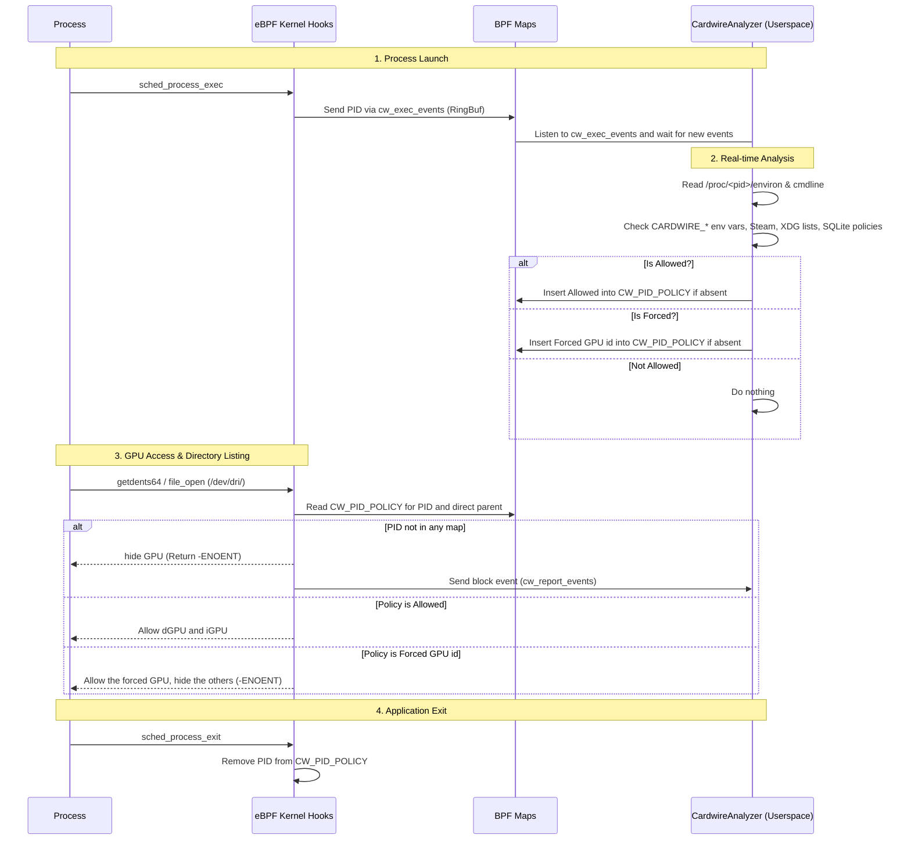

# Smart

## Goal and integration

Cardwire owns its per-application policy. It does not depend on desktop environment heuristics like `PrefersNonDefaultGPU` or on `DRI_PRIME`, `__NV_PRIME_RENDER_OFFLOAD` or SteamAppId being present in the app environment. Those auto-approval inputs were dropped in 0.12.0 and replaced by the internal application list, which makes cardwire self-sufficient while staying compatible with desktop environments through the [Switcheroo shim](dbus/switcheroo.md).

Third parties that want to integrate with cardwire get three surfaces:

- **Env**: the `CARDWIRE_*` environment variables route a process to a GPU at launch. The per-GPU environment can be fetched from the `Env` property of the [Gpu interface](dbus/gpu.md).
- **PID via API**: `RequestProcessAccess` atomically replaces the PID's `CW_PID_POLICY` entry. In this fork this administrative API requires an authenticated UID 0 system-bus caller. Apply it to an existing process (caution: applications often scan for GPUs at launch).
- **Management**: the [SmartPolicy D-Bus interface](dbus/smart-policy.md) lists known applications (`GetAppPolicies`), changes their persistent policy (`SetAppPolicy`) and announces discoveries (`NewAppAdded`).

One caveat applies to both routes: the eBPF program clears the PID's policy at every exec, so a process that execs again after being classified starts from a clean slate and is re-evaluated.

## Introduction

Having an integrated and hybrid mode is good, but what if we could have the best of both worlds?

This is what cardwire's smart mode was made for. Cardwire uses a mix of kernel-space + userspace to directly allow processes on the fly

### Kernel-Space

Using the eBPF program and the `tracepoint/sched/sched_process_exec` hooks, the kernel program notifies `cardwired` when a new process is executed, sending its pid using the `CW_EXEC_EVENTS` RING_BUF (in Smart and Manual modes). The analyzer may insert one `CW_PID_POLICY` entry. Its shared `u64` encoding represents either Allowed (`1 << 32`) or Forced (the `u32` GPU ID). There cannot be two conflicting entries for a PID.

Exec and main-thread exit hooks remove the PID's policy entry directly.

If you want to dive deeper into the kernel code, take a look at [BPF](bpf.md)

### Userspace

The userspace of Smart mode acts as the brain. It is responsible for making the actual decisions about whether a process is allowed to use a GPU. It is divided into three main components:

- **`CardwireAnalyzer`**: A dedicated background task that listens to the `CW_EXEC_EVENTS` ring buffer (and the `CW_REPORT_EVENTS` ring for blocked-access logging). It analyzes each new PID and inserts a `CW_PID_POLICY` entry using `BPF_NOEXIST`, preserving any administrative policy installed during analysis.
- **`dynamic_analysis.rs`**: A set of helper functions used to analyze a process in real-time. By reading `/proc/<pid>/environ` and `/proc/<pid>/cmdline`, it checks for explicitly requested GPUs (like `CARDWIRE_ALLOW=1`, `CARDWIRE_FORCE_DGPU=1`, `CARDWIRE_FORCE_GPU=<gpu_id>`) or implicit signs like Steam games (`SteamAppId`, the `0` and `769` ids are excluded).
- **`static_analysis.rs`**: A set of helper functions that analyze system data when the daemon starts. It scans the XDG data directories and watches them with inotify so new apps are picked up at install time. Every discovered app is blocked by default until the user allows it. The `xdg-desktop-portal` process is always blocked.

#### Notes

Technically, it's a pure race condition between the cardwire analyzer and the process, cardwire scans and allow a process in ~60-100 microseconds, from my testing, no process initialized its render before cardwire allowed it

## Complete Execution Flow

Here is a comprehensive breakdown of how the Kernel and Userspace interact in real-time when an application launches: (Please zoom on it)

## Application policies

Smart mode is only available on laptops (`SystemType::Laptop`). Per-application policies are stored in the `app_policies` table of the daemon's SQLite database, with two values: `Blocked` and `Allowed`. Known apps are blocked by default until the user allows them, and newly discovered apps are announced through the `NewAppAdded` D-Bus signal.

The policy for a process can be overridden at runtime through the `org.opengamingcollective.cardwire.SmartPolicy` D-Bus interface (`RequestProcessAccess`, `GetProcessStatus`, `GetAppPolicies`, `SetAppPolicy`). Note that `GetProcessStatus` returns an empty string (not `"Default"`) for unclassified processes.

`RequestProcessAccess` accepts `Allow_dGPU`, `Force_dGPU`, and `Force_GPU` for an existing process after authenticating the sender as root. Each request makes one complete map update; an error preserves the previous entry. Concurrent requests cannot leave both Allow and Force active for one PID. `GetProcessStatus` reads that same entry. `Default` remains an authenticated no-op, not a way to revoke a previous request. The method's wire signature is unchanged.

Status reports the PID's own policy, not inherited effects. Smart mode retains direct-parent Allow precedence; Manual mode ignores Allow entries. Numeric PID lifetime races, environment hints, built-in exemptions and authorization of other global APIs remain outside this change. See [the fork notes](../../FORK.md) for the security and deployment boundaries.

Force_GPU can be used on all systems with the Manual mode.
